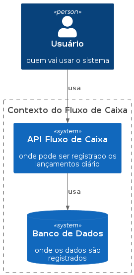
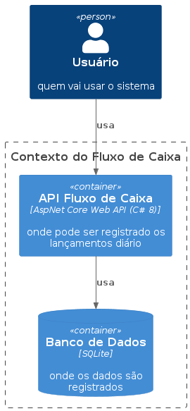
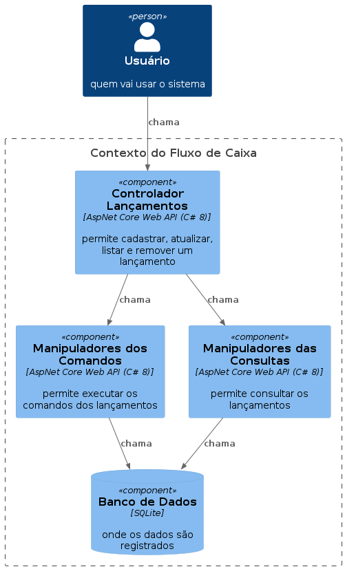
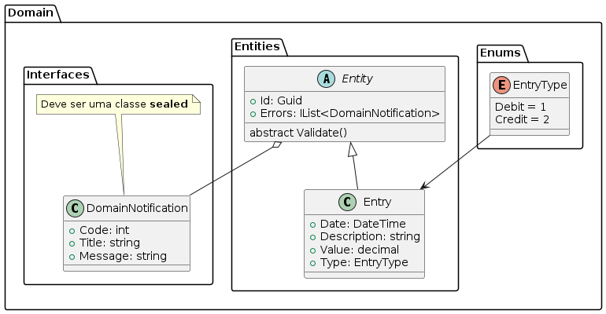
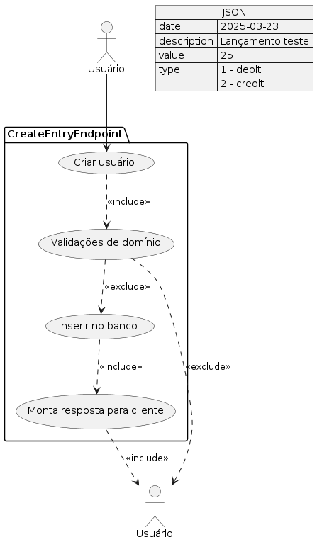
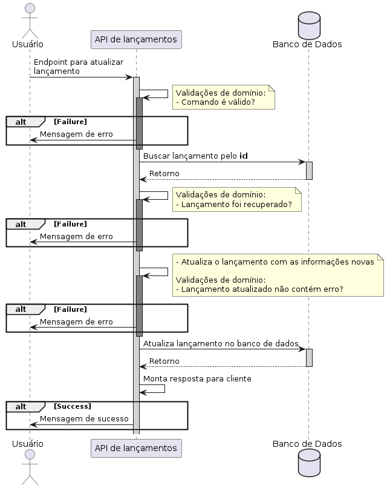

# Projeto: "Cash Flow"

## Objetivo Documento

Este documento tem como objetivo descrever o sistema __"Cash Flow"__. Suas informações incluem os endpoints, os payloads e as integrações de todo ecosistema do sistema.

## Sumário

1. [INTRODUÇÃO](#intro)
1.1. [Escopo](#escopo)
1.2. [Referências](#ref)
2. [REPRESENTAÇÃO ARQUITETURAL](#representacao)
3. [REQUISITOS ARQUITETURAIS](#requisitos)
4. [SYSTEM CONTEXT](#context)
5. [CONTAINER](#container)
6. [COMPONENT](#component)
7. [UML](#uml)
10. [DESCRIÇÃO ENDPOINTS](#endpoints)

## 1. INTRODUÇÃO

Este documento fornece uma visão arquitetural abrangente do sistema __"Cash Flow"__, usando diversas visões de arquitetura para representar diferentes aspectos do sistema. O objetivo deste documento é capturar e comunicar as decisões arquiteturais significativas que foram tomadas em relação ao sistema.

O documento irá adotar uma estrutura baseada na visão do “C4 Model” criado por Simon Brown.

### 1.1. Escopo

Este Documento de Arquitetura de Software se aplica ao __"Cash Flow"__ que será desenvolvido pela squad __"Ricardo"__.

### 1.2. Referências

[C4-Model]: The C4 model for visualizing software architecture, Simon Bronw, Entre 2006-2011, https://c4model.com/

## 2. REPRESENTAÇÃO ARQUITETURAL

Este documento irá detalhar as visões baseado no modelo “C4-Model, utilizando como referência os modelos definidos pelo C4-Model. As visões utilizadas no documento serão:

Nível | Diagrama | Descrição
:----:|:--------:|:---------
1 | System Context | Fornece um ponto de vista inicial, mostrando como o sistema funciona em uma visão geral.
2 | Container | Este diagrama amplia a visão do sistema, mostrando os blocos de construção técnicos de alto nível.
3 | Component | Este diagrama amplia a visão para dentro de cada container individual, mostrando a tecnologia envolvida no detalhe.
4 | Code (UML) | Este diagrama pode ser usado para ampliar a visão de cada componente individualmente, mostrando como o componente é implementado.

## 3. REQUISITOS ARQUITETURAIS

Esta seção descrever os requisitos de software significante na arquitetura.

Requisito | Solução
:--------:|:-------:
Linguagem/Tecnologia | .NET CORE 8 (C#, AspNet Web API).
Padrão de Arquitetura | Microserviço e Arquitetura em Camadas.
Princípio de Design | CQS e Modelagem Tática do DDD.

## 4. CONTEXTO DO SISTEMA

Esta seção fornece um ponto inicial, mostrando como o sistema funciona em uma visão geral.

## 5. DIAGRAMA DE CONTAINER

Esta seção amplia a visão do sistema, mostrando os blocos de construção técnicos de alto nível.

## 6. DIAGRAMA DE COMPONENTE

Esta seção amplia a visão do sistema, mostrando os componentes técnicos que serão chamados no sistema.

## 7. UML

### 7.1. Diagrama de Classe (Domínio)

### 7.2. Diagrama Caso de Uso 

#### 7.2.1. Endpoint criar lançamento

### 7.3. Diagrama de Sequência

#### 7.3.1. Endpoint atualizar lançamento

## 8. DESCRIÇÃO ENDPOINTS

Para ver os endpoint, os payloads e os responses da API, basta acessar o link __http://localhost:5290/api-docs__.